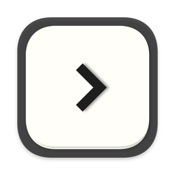
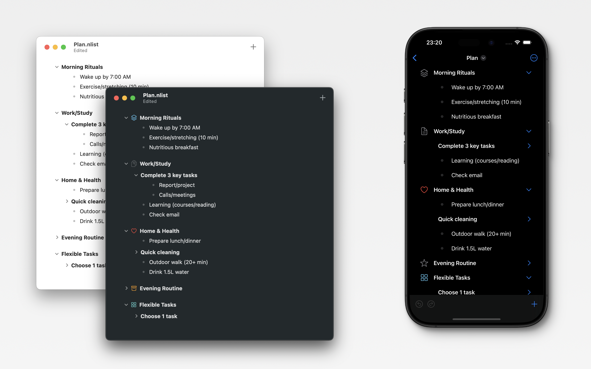

 

### Introducing the structural nested list editor for macOS

Create and edit nested lists with ease..

   

## Screenshots

## Introduction

Nested List — a **minimalist editor** for working with hierarchical lists

## Features

* Creating and editing nested lists of any complexity.
* Ability to customize the style and formatting of lists.
* `.nlist` file format (JSON-based)  
* Auto-save and iCloud sync  
* Automatic version conflict resolution  
* Clean interface with no clutter  
* Drag&Drop support.
* Hotkeys support.

## Guide

* Create:
	- Use Editor > New item to create a new item
	- Press ⌘T to create a new item
	- Right-click to use the context menu to create a new item
* Delete:
	- Use Editor > Delete to delete selected items
	- Open the context menu to delete selected items
	- Press ⌘⌫ to delete selected items
* Customization:
	- Use Editor > Icon to set or remove an icon for selected items
	- Use Editor > Color to set a color for selected items
	- Access the context menu to change icon and color of selected items
	- Choose Editor > Strikethrough to toggle the completion status
* Drag & Drop:
	- Drag plain text to the document
	- Move selected items to another document

## App Store

* App Store or Mac App Store : https://apps.apple.com/us/app/nested-list/id6738434530

## Localization

- English

## Privacy Policy

Last updated: July 13, 2026

Nested List is designed to keep the content of your documents under your control. This policy explains what data the app stores, what analytics data it sends, and how that data is used.

### Documents and iCloud

Documents that you create in Nested List are stored on your device as local files. If you enable iCloud Drive or store documents in an iCloud location, Apple may synchronize those files across your devices using iCloud. Document synchronization is provided by Apple and is governed by Apple's privacy terms.

Nested List does not upload the text, structure, titles, icons, colors, or other content of your documents to our own servers or to our analytics provider. If you do not want documents to be stored in iCloud, disable iCloud Drive or keep your documents outside iCloud locations.

### Analytics

Nested List uses Amplitude to collect limited analytics data so we can understand how the app is used, improve reliability, and prioritize product improvements. Analytics events may include:

- App interaction events, such as button taps, menu item selections, dropdown selections, toggle changes, drag and drop actions, and screen presentations.
- Event properties needed to describe those interactions, such as a stable control identifier, selected value, item count, content type for inserted drag and drop data, or screen area.
- An app-generated anonymous user identifier stored in app preferences.
- Session identifiers and event timestamps.
- General environment information, such as platform, operating system name and version, app version, preferred language, and region or country code when available.

Analytics data is sent to Amplitude through Amplitude's HTTP API. We do not send document contents, names, email addresses, contacts, photos, precise location, or payment information as part of analytics events.

### How Analytics Data Is Used

Analytics data is used only for app analytics, product improvement, and reliability monitoring. We do not use analytics data for third-party advertising, and we do not sell analytics data. We do not use analytics data to track you across apps or websites owned by other companies.

### App Store Privacy Information

For App Store privacy disclosures, Nested List's analytics collection should be treated as data collected by the app and by a third-party partner. The disclosed categories should remain consistent with the actual app behavior and may include analytics-related identifiers, product interaction or usage data, coarse location derived from region or country settings, and device or environment information such as operating system and app version.

### Data Retention and Choices

The anonymous analytics identifier is stored locally in app preferences and may persist between app launches. You can remove locally stored app preferences by deleting the app and its data from your device. Analytics data already sent to Amplitude may be retained according to Amplitude's data processing and retention practices.

You can reduce Apple iCloud data processing by disabling iCloud Drive or by storing documents outside iCloud locations. Apple provides more information about iCloud and privacy at https://support.apple.com/HT202303.

### Changes and Contact

We may update this Privacy Policy when app functionality, analytics practices, legal requirements, or App Store disclosure requirements change. If you have any questions or requests regarding this Privacy Policy, contact us at zeroindex@icloud.com

## Contact us
- email: zeroindex@icloud.com
