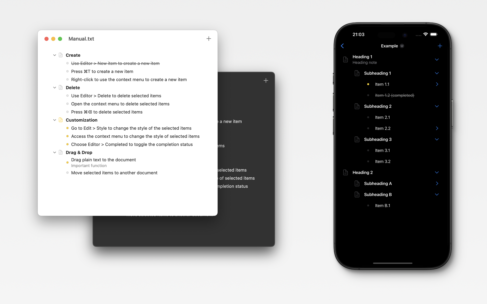

<a href="#"></a>

<br />

### Introducing the structural nested list editor for macOS

Create and edit nested lists with ease..


<br /><br /><br />

## Screenshots



## Introduction

My goal is to create an application for reading and editing nested lists in plain-text file format:

```
Section:
	- Marked Task 0 @mark
		- Subtask 0
		Note for Subtask 0
		- Completed Subtask 1 @done
	- Task 1
```

## Features

* Creating and editing nested lists of any complexity.
* Ability to customize the style and formatting of lists.
* Drag&Drop support.
* Hotkeys support.

## Guide

* Create:
	- Use Editor > New item to create a new item
	- Press ⌘T to create a new item
	- Right-click to use the context menu to create a new item
* Delete:
	- Use Editor > Delete to delete selected items
	- Open the context menu to delete selected items
	- Press ⌘⌫ to delete selected items
* Customization:
	- Go to Edit > Style to change the style of the selected items
	- Access the context menu to change the style of selected items
	- Choose Editor > Completed to toggle the completion status
* Drag & Drop:
	- Drag plain text to the document
	- Move selected items to another document

## Localization

- English

## Privacy Policy

Your docs (which you create and write inside Plan) are saved locally on your device as plain text-files and synchronized using across your devices using iCloud Drive (by Apple). Your data is not stored on our servers, not sent to any third-party service by us (other than mentioned Apple). The information is not sent outside of the app. The data is, however, saved on Apple's servers being an Apple technology, which might be in the U.S. If you don't want your data to be saved on Apple's server, disable iCloud (synchronization won't work). Disable 'iCloud Drive' as well, if you don't want your docs to be synchronized by Apple's servers. Read here more about how Apple is handling your data: https://support.apple.com/HT202303.

Our Privacy Policy may change from time to time. If you have any questions or suggestions regarding our Privacy Policy, please contact us at zeroindex@icloud.com

## Contact us
- email: zeroindex@icloud.com
